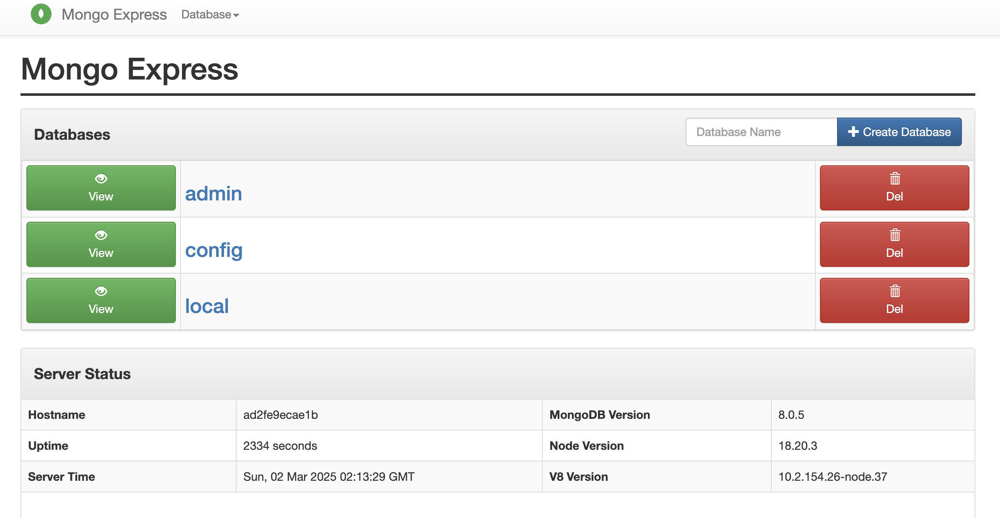

# Demo App - Developing with Docker

This demo app showcases a simple user profile application set up using:
- `index.html` with pure JavaScript and CSS styles
- A Node.js backend using the Express module
- MongoDB for data storage

All components are containerized using Docker.

## Running the Application with Docker

### 1. Create a Docker Network (Optional)

To allow containers to communicate with each other:

```sh
docker network create mongo-network
```

_Note: You can omit this step and use Docker's default network by removing the `--net` flag in the following commands._

### 2. Start MongoDB 

```sh
docker run -d -p 27017:27017 -e MONGO_INITDB_ROOT_USERNAME=admin -e MONGO_INITDB_ROOT_PASSWORD=password --name mongodb --net mongo-network mongo
```

### 3. Start Mongo-Express

```sh
docker run -d -p 8081:8081 -e ME_CONFIG_MONGODB_ADMINUSERNAME=admin -e ME_CONFIG_MONGODB_ADMINPASSWORD=password --net mongo-network --name mongo-express -e ME_CONFIG_MONGODB_SERVER=mongodb mongo-express
```

Now, open **Mongo-Express** in the browser:

```sh
http://localhost:8081
```
<div style="display: flex; justify-content: center; align-items: center; gap: 20px;">
  
</div>

### 4. Create Database and Collection

In **Mongo-Express**, create a new database `user-account_db` and a `users` collection.

### 5. Start the Node.js Application Locally

Navigate to the project directory and install dependencies:

```sh
npm install
node server.js
```

Now, access the application UI in your browser:

```sh
http://localhost:3000
```

---

## Running the Application with Docker Compose

To simplify the process, use Docker Compose.

### 1. Start MongoDB and Mongo-Express

```sh
docker-compose -f docker-compose.yaml up
```

Mongo-Express will be available at:

```sh
http://localhost:8081
```

### 2. Create Database and Collection

In **Mongo-Express**, create a new database `my-db` and a `users` collection.

### 3. Start the Node.js Server

```sh
npm install
node server.js
```

### 4. Access the Application UI

```sh
http://localhost:3000
```

---

## Building a Docker Image from the Application

To containerize the Node.js application:

```sh
docker build -t my-app:1.0 .
```

The `.` at the end indicates the location of the `Dockerfile`.

---

## Common Docker Commands

### Managing Containers and Images

- **Download an image**:  
  ```sh
  docker pull <image_name>
  ```
- **Run a container**:  
  ```sh
  docker run -d -p <host_port>:<container_port> --name <container_name> <image_name>
  ```
- **List running containers**:  
  ```sh
  docker ps
  ```
- **List all containers (including stopped ones)**:  
  ```sh
  docker ps -a
  ```
- **Stop a running container**:  
  ```sh
  docker stop <container_id>
  ```
- **Delete a container**:  
  ```sh
  docker rm <container_id>
  ```
- **Delete an image**:  
  ```sh
  docker rmi <image_id>
  ```
- **View local images**:  
  ```sh
  docker images
  ```

### Debugging Containers

- **View logs of a container**:  
  ```sh
  docker logs <container_id>
  ```
- **Access a running container in interactive mode**:  
  ```sh
  docker exec -it <container_id> /bin/bash
  ```
- **Exit interactive mode**:  
  ```sh
  ctrl + c
  ```

## Reference
This project is inspired by the Docker deployment guide from [Docker Tutorial for Beginners](https://gitlab.com/nanuchi/techworld-js-docker-demo-app).
